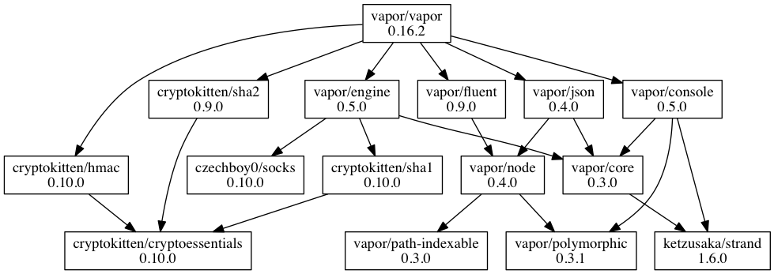

# swiftpm-dependency-fetcher
Dependencies of your SwiftPM packages as a service.

> WIP: not yet deployed on a server, feel free to clone and run locally

# Endpoints

- Get dependencies of a GitHub SwiftPM package:`/dependencies/AUTHOR/REPO?format=FORMAT`
	- e.g. `/dependencies/czechboy0/Jay?format=png`
	- available formats:
		- `json` - JSON of the dependency graph
		- `png` - png image of the rendered dependency graph
		- `dot` - [dot/gv](https://en.wikipedia.org/wiki/DOT_(graph_description_language)) format (open in any graphing app, e.g. OmniGraffle)

# Example

`/dependencies/vapor/vapor?format=png` returns the following rendered dependency tree

# Requirements for running locally

- a Redis server running on the port 6380 before booting the server (just `redis-server ./Redis/redis.conf` from the root folder to start the server with the desired config)
- a GitHub personal token in the `$GITHUB_TOKEN` environment variable

:gift_heart: Contributing
------------
Please create an issue with a description of your problem or open a pull request with a fix.

:v: License
-------
MIT

:alien: Author
------
Honza Dvorsky - http://honzadvorsky.com, [@czechboy0](http://twitter.com/czechboy0)

