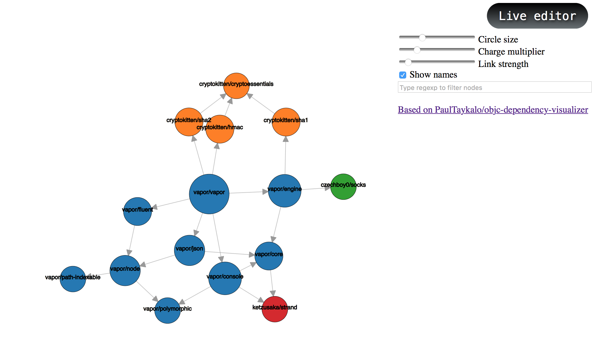
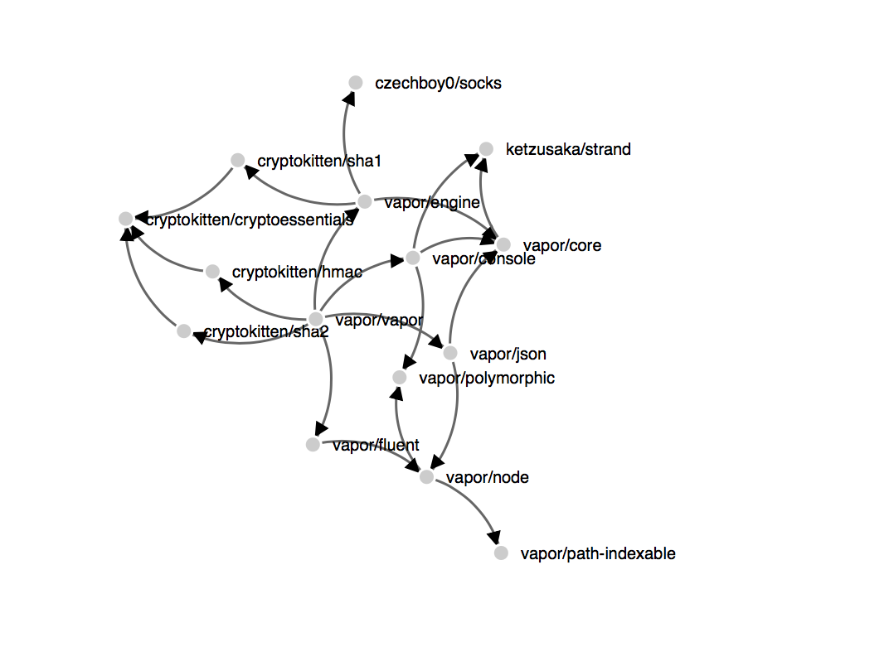
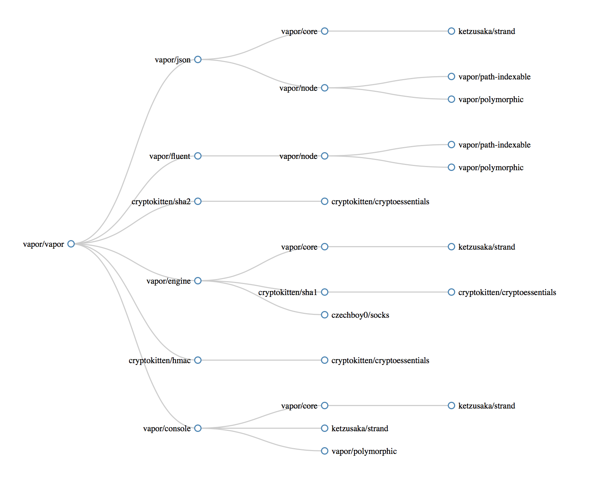

# swiftpm-dependency-fetcher
Dependencies of your SwiftPM packages as a service.

> Runs on [http://swiftpm-deps.honza.tech](http://swiftpm-deps.honza.tech).

# Endpoints

- Get dependencies of a GitHub SwiftPM package:`/dependencies/AUTHOR/REPO?format=FORMAT&tag=TAG`
	- both `format` and `tag` are optional
	- if `format` is not specified, `json` is used
	- if `tag` is not specified, the latest tag found on GitHub is used
	- e.g. `/dependencies/czechboy0/Jay?format=png&tag=0.19.0`
	- available formats:
		- `json` - JSON of the dependency graph
		- `png` - png image of the rendered dependency graph
		- `dot` - [dot/gv](https://en.wikipedia.org/wiki/DOT_(graph_description_language)) format (open in any graphing app, e.g. OmniGraffle)
		- `d3deps` a page with an interactive dependency graph 1 (experimental, will change)
		- `d3graph` a page with an interactive dependency graph 2 (experimental, will change)
		- `d3tree` a page with an interactive dependency tree 3 (experimental, will change)
		- `d3depsjs` dependencies in JavaScript format for a d3 graph 1 (experimental, will change)
		- `d3graphjson` dependencies in JSON format for a d3 graph 2 (experimental, will change)
		- `d3treejson` dependencies in JSON format for a d3 tree 3 (experimental, will change)

# Example

[http://swiftpm-deps.honza.tech/dependencies/vapor/vapor?format=png&tag=0.16.2](http://swiftpm-deps.honza.tech/dependencies/vapor/vapor?format=png&tag=0.16.2) returns the following rendered dependency tree

# Adding dependency graph in your README

You can add an image of your dependency tree by just adding the following line

``, where you fill in your `AUTHOR` and `REPO`. 

This is a live rendered dependency tree for this repository, `swiftpm-dependency-fetcher`:

> Please note that it might take a few seconds to render the image for the first time (then it's cached for 24 hours), so if your README fails to pull the image, refresh in a few seconds. I'm working on making things faster, but this is a way to keep things mostly correct.

# Requirements for running locally

- a Redis server running on the port 6380 before booting the server (just `redis-server ./Redis/redis.conf` from the root folder to start the server with the desired config)
- a GitHub personal token in the `$GITHUB_TOKEN` environment variable

# Interactive D3 graphs

You can also view your dependencies in 3 interactive formats:

## 1. d3-deps

## 2. d3-graph

## 3. d3-tree

:gift_heart: Contributing
------------
Please create an issue with a description of your problem or open a pull request with a fix.

:v: License
-------
MIT

:alien: Author
------
Honza Dvorsky - http://honzadvorsky.com, [@czechboy0](http://twitter.com/czechboy0)

